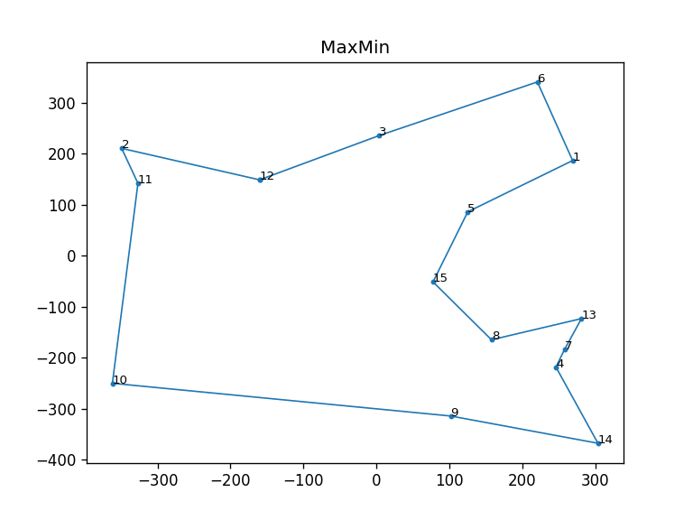

## Solving Travelling Salesman Problem using Ant Colony Optimization

### Install dependencies
`pip install -r requirements.txt`

### Usage
The demo is given in the last section of the file. You can also import this file and do the following -
```python
import random
# Instantiate SolveTSPUsingACO passing the desired parameters
acs = SolveTSPUsingACO(mode='ACS', nodes=[(random.uniform(-400, 400), random.uniform(-400, 400)) for _ in range(0, 15)])
# Run the optimization
acs.run()
# Plot the tour
acs.plot()
```

### Example
```python
_colony_size = 5
_steps = 50
_nodes = [(random.uniform(-400, 400), random.uniform(-400, 400)) for _ in range(0, 15)]
acs = SolveTSPUsingACO(mode='ACS', colony_size=_colony_size, steps=_steps, nodes=_nodes)
acs.run()
acs.plot()
elitist = SolveTSPUsingACO(mode='Elitist', colony_size=_colony_size, steps=_steps, nodes=_nodes)
elitist.run()
elitist.plot()
max_min = SolveTSPUsingACO(mode='MaxMin', colony_size=_colony_size, steps=_steps, nodes=_nodes)
max_min.run()
max_min.plot()
```

#### Output
```
Started : ACS
Ended : ACS
Sequence : <- 2 - 11 - 12 - 3 - 1 - 6 - 5 - 15 - 8 - 7 - 13 - 4 - 14 - 9 - 10 ->
Total distance travelled to complete the tour : 2977.62

Started : Elitist
Ended : Elitist
Sequence : <- 1 - 6 - 3 - 12 - 11 - 2 - 10 - 9 - 14 - 4 - 7 - 13 - 8 - 15 - 5 ->
Total distance travelled to complete the tour : 2815.67

Started : MaxMin
Ended : MaxMin
Sequence : <- 12 - 2 - 11 - 10 - 9 - 14 - 4 - 7 - 13 - 8 - 15 - 5 - 1 - 6 - 3 ->
Total distance travelled to complete the tour : 2780.43
```

#### Plots 
  
   


### Reference
www.theprojectspot.com/tutorial-post/ant-colony-optimization-for-hackers/10
