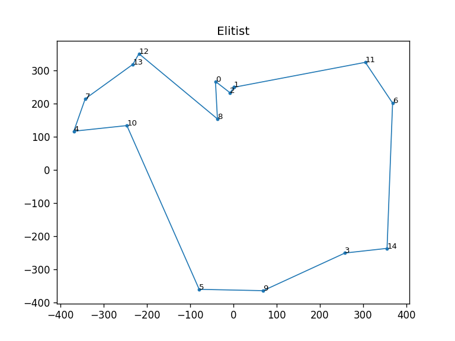
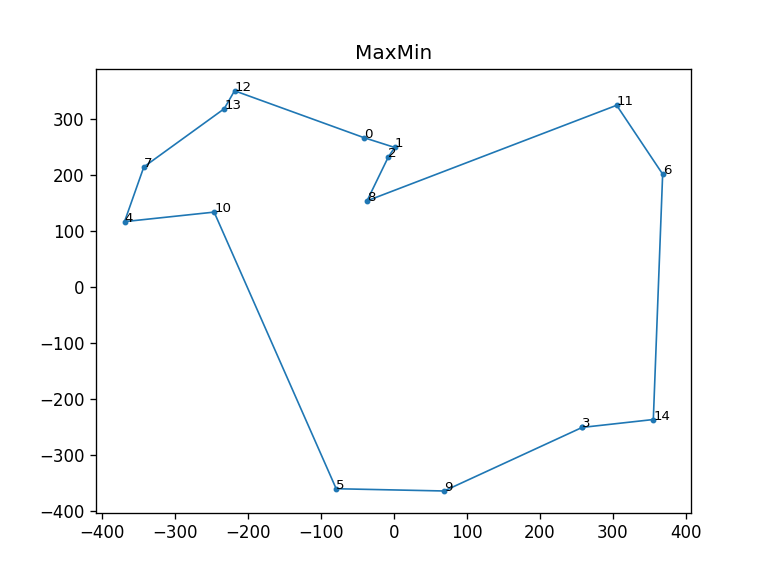

## Solving Travelling Salesman Problem using Ant Colony Optimization

#### Install dependencies
`pip install -r requirements.txt`

#### Usage
The demo is given in the last section of the file. You can also import this file and do the following -
```python
// Instantiate SolveTSPUsingACO passing the desired parameters
acs = SolveTSPUsingACO(mode='ACS')
// Run the optimization
acs.run()
// Plot the tour
acs.plot()
```

#### Example
```python
acs = SolveTSPUsingACO(mode='ACS', steps=50, num_nodes=15, x_range=(-400, 400), y_range=(-400, 400))
acs.run()
acs.plot()
elitist = SolveTSPUsingACO(mode='Elitist', steps=50, nodes=acs.nodes)
elitist.run()
elitist.plot()
max_min = SolveTSPUsingACO(mode='MaxMin', steps=50, nodes=acs.nodes)
max_min.run()
max_min.plot()
```
##### Output
```
Started: ACS
Ended: ACS
Tour: [6 -> 10 -> 4 -> 15 -> 7 -> 12 -> 2 -> 3 -> 1 -> 9 -> 14 -> 13 -> 8 -> 5 -> 11 -> 6]
Distance: 2761.06

Started: Elitist
Ended: Elitist
Tour: [2 -> 3 -> 1 -> 9 -> 13 -> 14 -> 8 -> 5 -> 11 -> 6 -> 10 -> 4 -> 15 -> 7 -> 12 -> 2]
Distance: 2740.04

Started: MaxMin
Ended: MaxMin
Tour: [4 -> 15 -> 7 -> 12 -> 9 -> 3 -> 2 -> 1 -> 13 -> 14 -> 8 -> 5 -> 11 -> 6 -> 10 -> 4]
Distance: 2705.84
```
##### Plots
ACS  
  
Elitist  
   
MaxMin  


#### Reference
www.theprojectspot.com/tutorial-post/ant-colony-optimization-for-hackers/10
